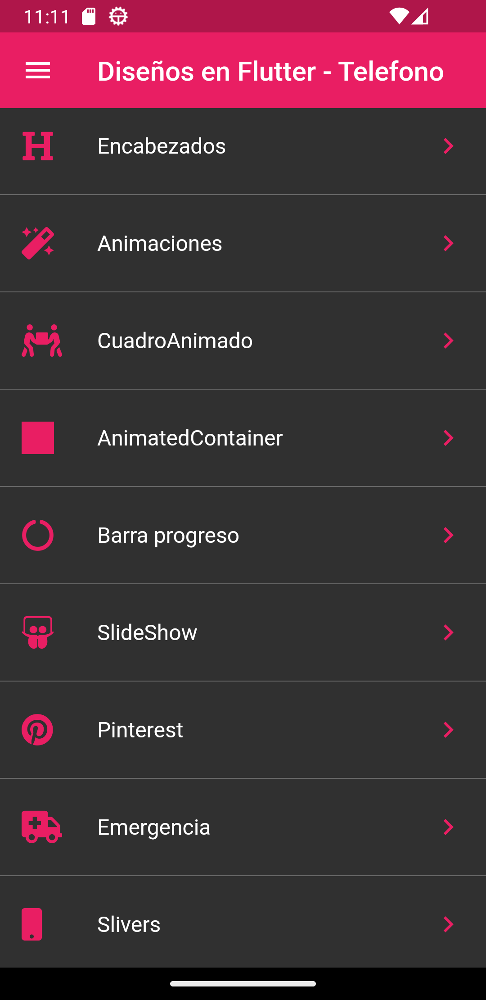
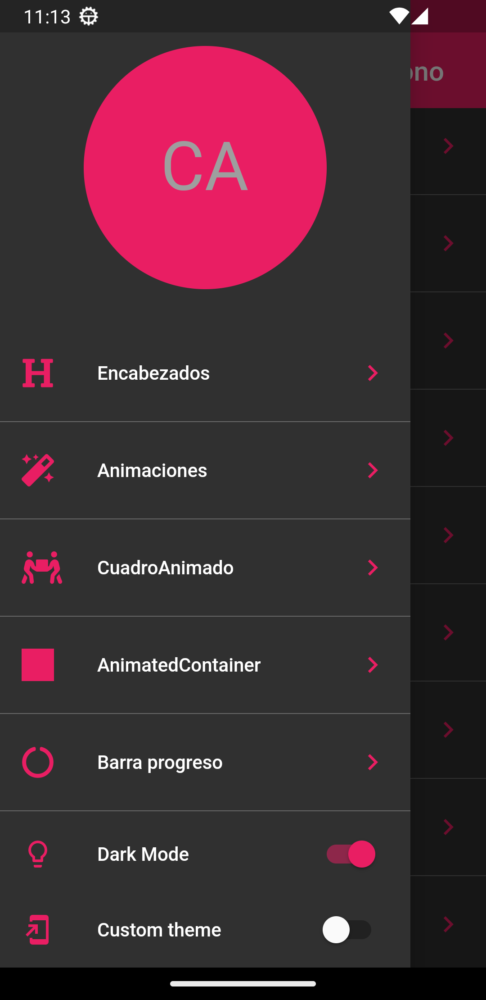
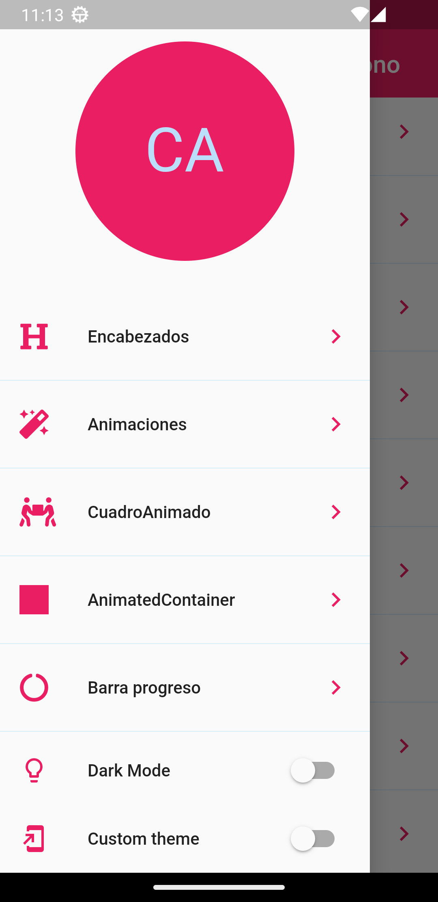
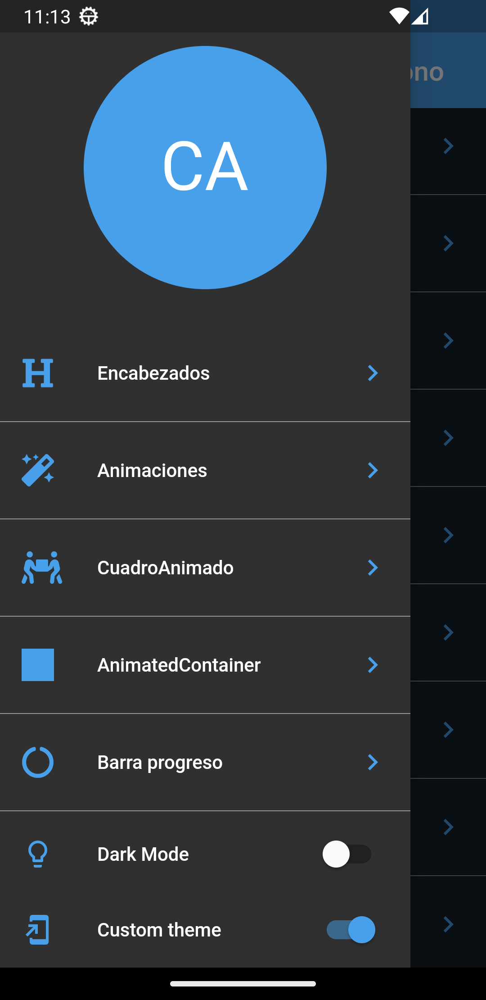
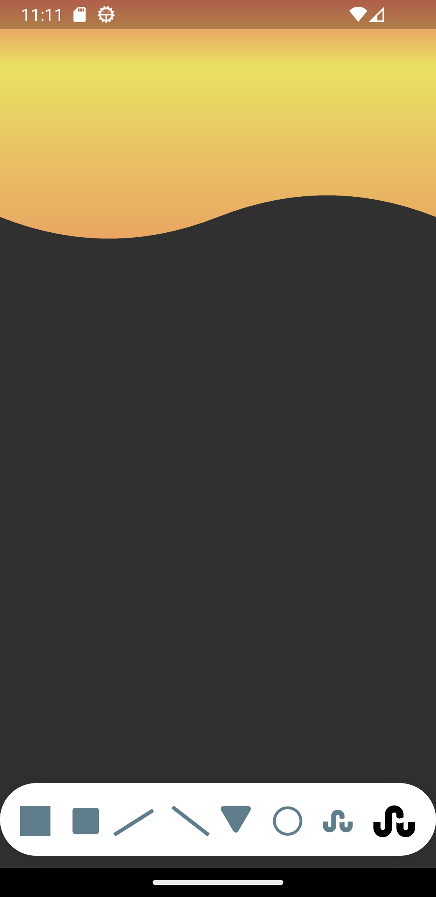
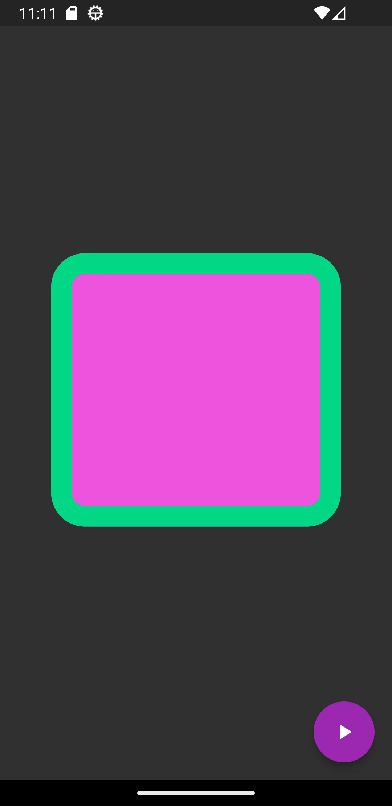
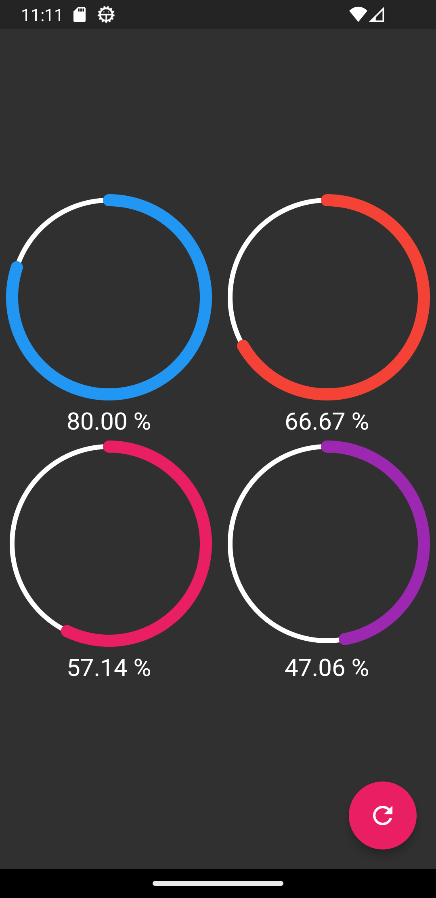
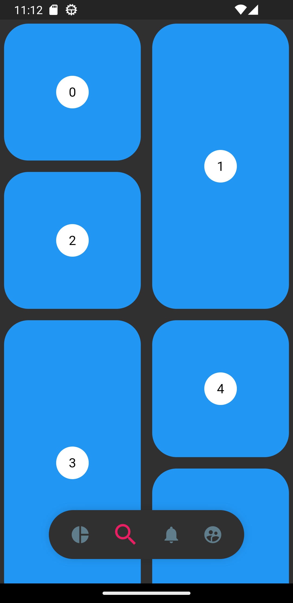
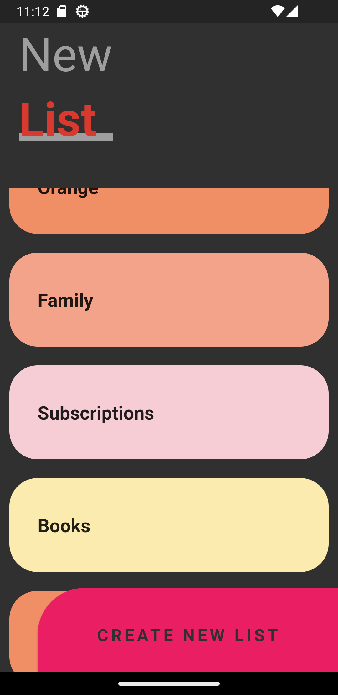

# Flutter profesional designs

Here we have a Flutter project showing many components and packages that are advanced and make our design much more professional.
We have things like:
-Drawer

- Custom themes
  -Custom painter
- Animations of all kinds
- Progress bars
- SlideShow
- Grid display like the pinterest application (different size for each item)
- Emergency layout, with gradients icons, etc.
- Slivers

  
  
  
  
  
  
  
  
  
  
  
  
  

